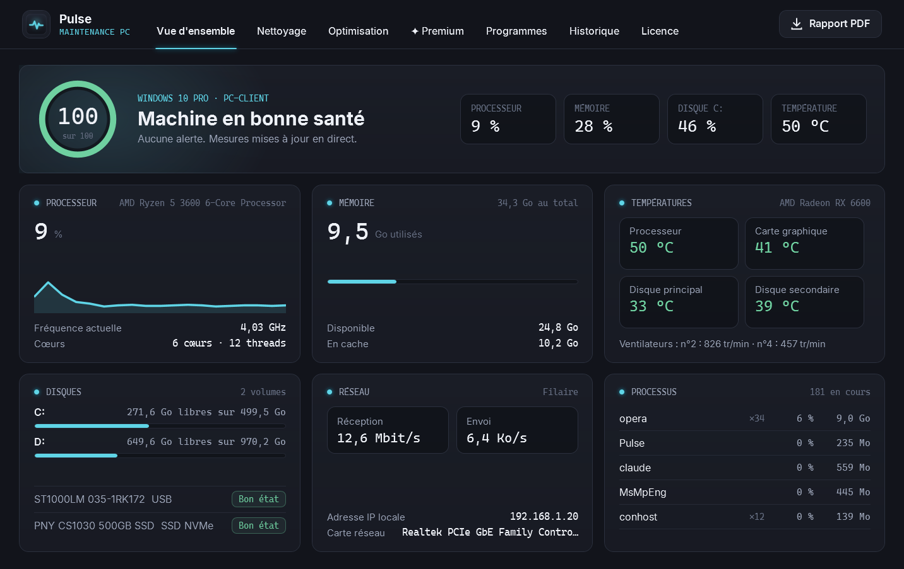
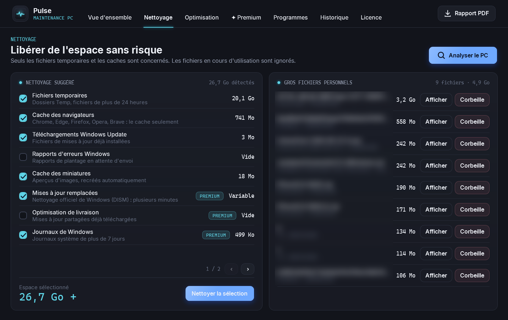
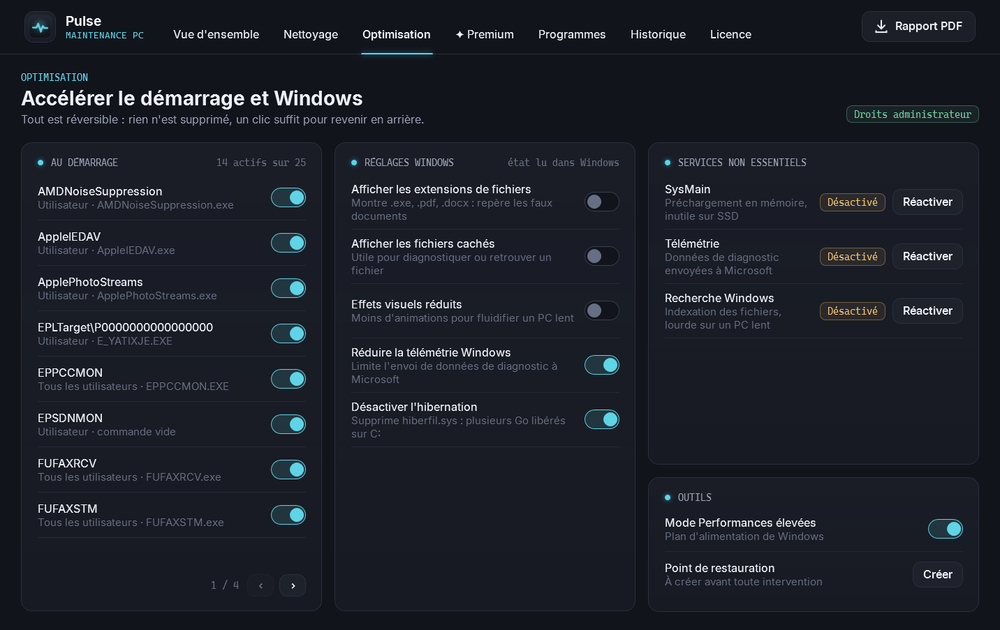
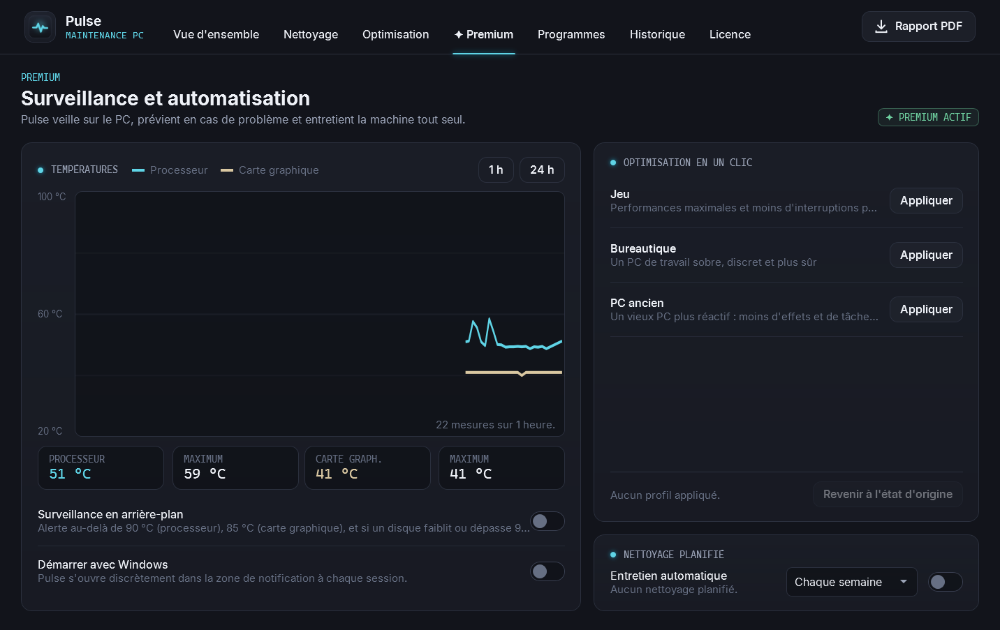
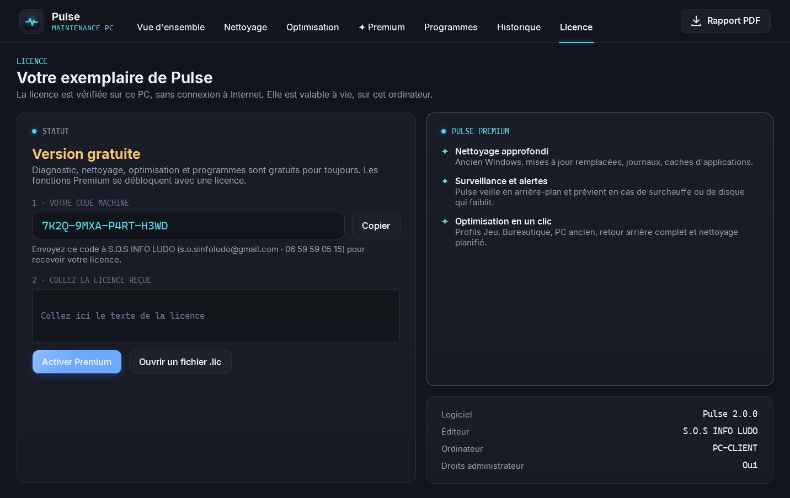

# 🩺 Pulse

### Le bilan de santé et l'entretien de votre PC, en un coup d'œil.

*Températures, disques, mémoire, programmes au démarrage : Pulse mesure tout en direct, nettoie sans risque et optimise Windows de façon réversible. Gratuit, en français, sans publicité.*

 

 

<i>La vue d'ensemble : score de santé, températures, disques, réseau et processus, mis à jour en direct.</i>

  

[**Pourquoi**](#-pourquoi-pulse-) · [**Fonctionnalités**](#-fonctionnalités) · [**Gratuit ou Premium**](#-gratuit-ou-premium-) · [**En images**](#%EF%B8%8F-en-images) · [**Télécharger**](#%EF%B8%8F-télécharger) · [**Questions fréquentes**](#-questions-fréquentes)

 

---

## 💡 Pourquoi Pulse ?

Un PC qui ralentit, chauffe ou se remplit ne prévient pas : il faut plusieurs outils pour comprendre ce qui se passe, et les « nettoyeurs » habituels suppriment parfois bien plus qu'ils ne devraient.

**Pulse a été conçu par un technicien, pour l'atelier comme pour la maison.** Il affiche d'un coup d'œil l'état réel de la machine, y compris la **température du processeur et de la carte graphique**, puis propose un entretien **sans risque et réversible** : rien n'est supprimé sans votre accord, et chaque réglage se défait d'un clic.

 

## ✨ Fonctionnalités

<table>
<tr>
<td width="50%" valign="top">

### 🩺 Diagnostic en direct
- **Score de santé** et alertes claires, en français.
- **Températures** du processeur, de la carte graphique (AMD, NVIDIA, Intel) et des disques.
- **État des disques** : « bon état », « à surveiller » ou « défaillant ».
- Processeur, mémoire, réseau, ventilateurs et processus en temps réel.

</td>
<td width="50%" valign="top">

### 🧹 Nettoyage sans risque
- Fichiers temporaires **de plus de 24 h** seulement, caches des navigateurs, miniatures, Corbeille.
- **Les favoris, mots de passe et historiques ne sont jamais touchés.**
- Les fichiers ouverts sont laissés en place, l'espace libéré affiché est exact.
- Gros fichiers personnels envoyés **à la Corbeille**, donc récupérables.

</td>
</tr>
<tr>
<td width="50%" valign="top">

### ⚡ Optimisation réversible
- **Programmes au démarrage** activés ou désactivés comme dans le Gestionnaire des tâches.
- Réglages Windows utiles : extensions de fichiers, effets visuels, télémétrie, hibernation.
- Services non essentiels, mode Performances élevées, **point de restauration** vérifié.

</td>
<td width="50%" valign="top">

### 📄 Programmes et rapport
- Liste des logiciels installés, du plus lourd au plus léger, avec **désinstalleur officiel**.
- **Rapport PDF** de maintenance à remettre au client : matériel, mesures, disques, interventions.
- **Historique** de toutes les interventions réalisées sur le PC.

</td>
</tr>
</table>

 

## 💎 Gratuit ou Premium ?

Pulse est **gratuit pour toujours** : tout ce qui est décrit ci-dessus fonctionne sans licence, sans limite de durée. La version **Premium** ajoute trois fonctions avancées, débloquées **à vie** sur votre ordinateur, pour **19 €** en une seule fois : pas d'abonnement.

| | Gratuit | ✦ Premium · 19 € à vie |
|---|:---:|:---:|
| Diagnostic en direct, températures, état des disques | ✅ | ✅ |
| Nettoyage sans risque, gros fichiers | ✅ | ✅ |
| Optimisation réversible, programmes, rapport PDF | ✅ | ✅ |
| **Nettoyage approfondi** : ancien Windows, mises à jour remplacées, journaux, caches d'applications | | ✅ |
| **Surveillance et alertes** : courbes de températures sur 24 h, alerte en cas de surchauffe ou de disque qui faiblit, démarrage avec Windows | | ✅ |
| **Optimisation en un clic** : profils Jeu, Bureautique, PC ancien, retour exact à l'état d'origine, nettoyage planifié | | ✅ |

### Obtenir Premium · 19 €

1. Ouvrez l'onglet **Licence** de Pulse et cliquez sur **Copier** à côté de votre **code machine**.
2. Envoyez ce code à **S.O.S INFO LUDO** : ✉️ **s.o.sinfoludo@gmail.com** · 📞 **06 59 59 05 15**.
3. Réglez **19 €** : par **carte bancaire** (lien de paiement sécurisé Zettle envoyé par e-mail), par **virement**, ou en **espèces** à l'atelier de Boulogne-sur-Mer.
4. Vous recevez votre licence par e-mail : collez-la dans l'onglet **Licence** (ou ouvrez le fichier `.lic`), puis cliquez sur **Activer Premium**.

> La licence est vérifiée **sur votre PC, sans connexion Internet**, et reste valable à vie sur cet ordinateur. Micro-entreprise : TVA non applicable, article 293 B du CGI.

 

## 🖼️ En images

<table>
<tr>
<td width="50%" align="center">
 
<b>Nettoyage</b> Chaque cible est expliquée et cochée par vous, les fichiers ouverts sont épargnés.
</td>
<td width="50%" align="center">
 
<b>Optimisation</b> Démarrage, réglages Windows et services : l'état affiché est lu dans Windows.
</td>
</tr>
<tr>
<td width="50%" align="center">
 
<b>✦ Premium</b> Courbes de températures, alertes, profils en un clic et nettoyage planifié.
</td>
<td width="50%" align="center">
 
<b>Licence</b> Le code machine à envoyer, puis la licence à coller : c'est tout.
</td>
</tr>
</table>

 

## ⬇️ Télécharger

### [**➜ Page de téléchargement (dernière version)**](https://github.com/lerapeurdu62280-debug/Pulse-Download/releases/latest)

| Fichier | Pour qui ? |
|---|---|
| **`Pulse-Setup.exe`** | Installation classique, avec raccourci dans le menu Démarrer. **Recommandé.** |
| **`Pulse-Portable.exe`** | Aucune installation : un seul fichier, à lancer depuis n'importe quel dossier ou clé USB (pratique en dépannage). |

> **Windows affiche « Windows a protégé votre ordinateur » ?** C'est normal pour un logiciel récent. Cliquez sur **Informations complémentaires**, puis sur **Exécuter quand même**.
>
> Pulse demande les **droits administrateur** au lancement : ils sont nécessaires pour nettoyer les dossiers système, gérer les services et lire les capteurs.

### 🖥️ Configuration requise
- **Windows 10 ou 11**, 64 bits. Rien d'autre à installer.
- Environ **250 Mo** d'espace disque.

 

## ❓ Questions fréquentes

<b>Pulse envoie-t-il des données sur Internet ?</b>

 
Non. Pulse fonctionne entièrement sur votre PC : aucune mesure, aucun fichier et aucune information personnelle ne sont envoyés. La licence elle-même est vérifiée hors ligne.

<b>Le nettoyage peut-il supprimer quelque chose d'important ?</b>

 
Pulse ne touche qu'aux dossiers de fichiers temporaires et de cache, et seulement ce que vous cochez. Les favoris, mots de passe et historiques des navigateurs ne sont jamais concernés, les fichiers en cours d'utilisation sont laissés en place, et vos gros fichiers personnels partent à la Corbeille, donc restent récupérables.

<b>La température du processeur ne s'affiche pas.</b>

 
Windows ne donne pas accès à la température du processeur. Pulse utilise pour cela <b>PawnIO</b>, un pilote signé et libre (le même principe que les outils de diagnostic professionnels). S'il n'est pas encore installé, cliquez sur <b>Installer le pilote</b> dans la carte « Températures » : son installeur officiel s'ouvre. La température de la carte graphique, elle, fonctionne sans rien installer.

<b>Puis-je annuler une optimisation ?</b>

 
Oui. Chaque interrupteur se remet dans l'autre sens d'un clic, les programmes au démarrage sont seulement désactivés (jamais supprimés), et les profils Premium enregistrent l'état d'origine : « Revenir à l'état d'origine » remet tout comme avant.

<b>Je change d'ordinateur : ma licence Premium est-elle perdue ?</b>

 
La licence est liée à un ordinateur. En cas de changement de PC ou de carte mère, contactez S.O.S INFO LUDO avec votre nouveau code machine.

 

---

**Pulse** · conçu et développé par **S.O.S INFO LUDO**, Boulogne-sur-Mer

Logiciel propriétaire, tous droits réservés. Composants tiers : LibreHardwareMonitorLib (MPL-2.0), pilote PawnIO (GPL-2.0, installeur officiel non modifié), QuestPDF, polices Inter et Cascadia Mono (OFL). Windows est une marque de Microsoft Corporation ; AMD, NVIDIA et Intel sont des marques de leurs propriétaires respectifs. Ce logiciel est indépendant.

